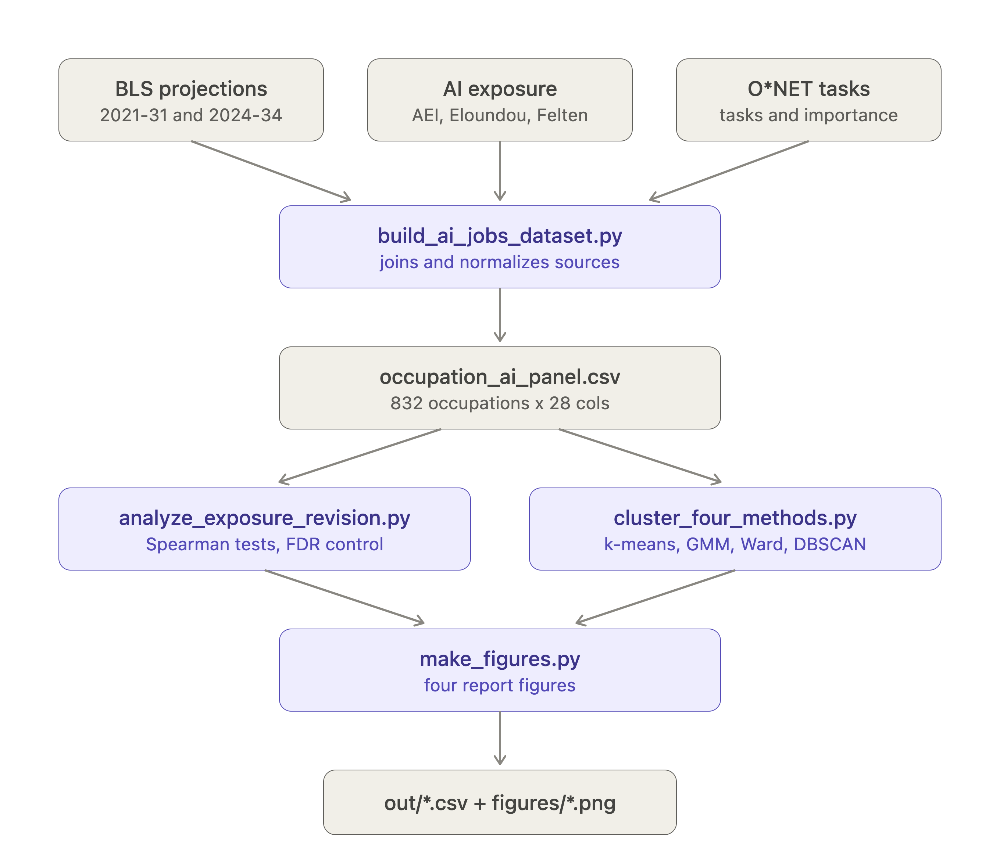

# Did AI expose which occupations are most AI-driven?

The Bureau of Labor Statistics updates and publishes ten-year employment projections for every
occupation in the United States every couple of years. One of those
updates was finalized in September 2022, right before ChatGPT came out. Another was
released in August 2025, a massive gap considering how fast AI moves. 

So there's a natural comparison sitting there: take the same occupation, look at what
the BLS predicted for the occupation before generative AI, opposed to what they predict now. You can see how
much the number has moved, as well as the direction of the move. Another question then arises when we look at 
those occupations. Of those that showed the most change, are those occupations the ones that AI was expected to impact the most
or were they simply the occupations that AI enhanced?

This repo builds the dataset that lets you infer inquiries and define your own answer,
there were four main unsupervised techniques used to derive the results. The four different clustering algorithms 
describe the structure of occupations-space, and runs correlation tests that carry the actual claim to draw valuable insights.

**Short version of the answer:** The general effect looks real if you just correlate AI and occupations
but mostly disappears once you control for the obvious confounds. More on that
below, including why the honest reading may reside somewhere in the middle.

---



## How to run it

```bash
pip install -r requirements.txt

python build_ai_jobs_dataset.py        # 1. build the dataset
python analyze_exposure_revision.py    # 2. run the hypothesis tests
python cluster_four_methods.py         # 3. run the four clustering models
python make_figures.py                 # 4. draw the report figures
```

Run them in that order. Step 1 writes the panel that steps 2 and 3 read; step 4 reads the
outputs of both. Nothing needs an API key, an account, or a config file.

**It runs offline.** Every input file is committed under `raw/`, so a fresh clone works
with no network access at all. You should not need `--manual`, but it's there if you've
deleted `raw/` and want the download list:

```bash
python build_ai_jobs_dataset.py --manual   # lists every source file + URL, marks what's missing
```

### Useful flags

```bash
python build_ai_jobs_dataset.py --pre 2019-29      # use the older pre-AI vintage
python build_ai_jobs_dataset.py --skip-optional    # BLS + O*NET only, no exposure measures
python analyze_exposure_revision.py --drop-pandemic # drop the 79 COVID-distorted occupations
python cluster_four_methods.py --kmax 6            # search fewer values of k
python cluster_four_methods.py --include-outcome   # the circular specification, for contrast
```

### What's in the repo

```
build_ai_jobs_dataset.py        1. builds the combined dataset
analyze_exposure_revision.py    2. the hypothesis tests and derived variables
cluster_four_methods.py         3. the four unsupervised models
make_figures.py                 4. every figure that appears in the report
requirements.txt
README.md
raw/                            all nine input files, committed
out/                            generated CSVs
figures/                        generated PNGs
```

### Why the data is committed rather than downloaded

All nine input files live in `raw/` (about 2 MB total). This is deliberate:

- `bls.gov` blocks datacenter IP ranges, so any cloud notebook fails to fetch the two
  projection workbooks.
- O\*NET's download URLs are version-numbered. An automatic fetch could quietly pull a
  different release than the one analyzed here and change the task counts without anyone
  noticing. The committed copy pins the version.
- The Anthropic Economic Index files don't sit at a stable URL.

The download code in `build_ai_jobs_dataset.py` still exists, but on a normal run every
request short-circuits on the cache check and never fires. Treat it as documentation of
where each file came from, plus a fallback if someone clears `raw/`. All nine files are
under licenses that permit redistribution — see the licensing section at the bottom.

---

## Where the data comes from

Three kinds of input, all joined on occupation code.

**The employment projections.** Two vintages from BLS. The 2021–31 cycle is the "before"
picture — finalized September 2022, the last complete forecast produced before generative
AI became a mainstream concern. The 2024–34 cycle, released August 2025, is the "after."
Both use 2018 SOC codes, so they join directly.

We picked 2021–31 over the earlier 2019–29 cycle because it's closer in time, but it has
a real weakness: its base year is 2021, when food service, personal care, and arts
employment were still depressed by COVID. Those occupations got projected to "recover"
strongly, and later vintages walked that back. That has nothing to do with AI and it's
the single biggest thing we have to control for.

**Four measures of AI exposure.** This is the part we're most confident about, because
the four were built in completely different ways by completely different people:

- The **Anthropic Economic Index** measures what people actually do with Claude, mapped
  onto occupations. It's behavioral — observed usage, not anyone's opinion about what AI
  could do.
- **Eloundou et al.'s "GPTs are GPTs"** took the opposite approach: human raters applied
  a written rubric to occupations and tasks, and GPT-4 applied the same rubric separately.
  They report three thresholds — *alpha* is direct LLM exposure, *beta* adds software
  built on top of LLMs, *gamma* is the broadest.
- **Felten, Raj & Seamans' AIOE** predates LLMs entirely. It scores occupations by how
  much they rely on human abilities that AI in general has gotten good at.
- **Claude usage share by task**, also from the Anthropic index, summed to the occupation.

Two are opinion-based, one is behavioral, one is pre-LLM. If they all point the same
direction, that could indicate some significance. 

**Task data from O\*NET.** Every task belonging to every occupation, whether it's core or
supplemental, and how important raters judged it. This is what lets us work at the task
level rather than a broad overview at the occupation level. 

### How the joins work

Most of the sources use 2018 SOC codes, which acts as a key to join on. 
We did however run into two wrinkles:

O\*NET uses codes like `15-1252.00`, which is the 2018 SOC code `15-1252` plus a detail
suffix. Chopping the suffix gets you the SOC code. Where several O\*NET occupations roll
up into one SOC code, scores are averaged and task lists pooled.

Felten's AIOE uses **2010** SOC codes, which are not the same thing. We run it through
the official BLS 2010→2018 crosswalk. If that crosswalk is unreachable, the build falls
back to assuming codes didn't change — true for most occupations, wrong for the recoded
ones. That's a known accuracy cost and the script warns when it happens.

Task-level files join on normalized task text, which works but leaves a small unmatched
tail.

---

## What comes out

| File | Written by | What it is |
|---|---|---|
| `out/occupation_ai_panel.csv` | step 1 | ~832 rows, one per occupation, everything joined |
| `out/occupation_task_long.csv` | step 1 | ~18,800 rows, one per occupation × task |
| `out/hypothesis_tests.csv` | step 2 | every exposure measure vs revision, raw and residualized, with FDR flags |
| `out/revision_derived.csv` | step 2 | `revision_resid` and `pandemic_sensitive` per occupation |
| `out/clusters_four_methods.csv` | step 3 | the panel plus all four models' labels. **The analysis file.** |
| `out/cluster_profiles_four_methods.csv` | step 3 | cluster averages, for naming the archetypes |
| `out/method_agreement_ari.csv` | step 3 | the cross-method agreement matrix |
| `figures/fig1..fig4*.png` | step 4 | the report figures |

### The variables that carry the argument

**`revision_pp`** is projected growth in the new vintage minus projected growth in the old
one, in percentage points. Negative means BLS now expects the occupation to grow more
slowly than previously. Built in step 1.

**`revision_resid`** is `revision_pp` after regressing out pre-AI projected growth, built
in step 2. Here's why it exists. Occupations projected to grow fast get revised downward
almost automatically — regression to the mean, which would happen with or without AI. In
this data that relationship has an R² of 0.39, meaning **39% of the raw revision is mean
reversion alone.** Any claim about AI has to survive that control.

**`pandemic_sensitive`** flags the 79 occupations in SOC majors 35 (food service), 39
(personal care), and 27 (arts and media). They average a **−8.3pp** revision against
**−1.9pp** for everything else. That gap is indicative of COVID recovery being unwound, not AI.

### Other columns worth mentioning

Identifiers are `soc_code`, `occ_title`, `soc_major`, and `bls_merge` (whether the
occupation appears in both vintages or only one). Projections are `emp_2021` / `emp_2031`
/ `pct_chg_2021_2031` for the pre vintage, the `2024` / `2034` equivalents for the post
vintage, plus `openings_*`, `median_wage_2024`, and `education_2024`. Exposure columns are
`aei_observed_exposure`, `gpts_human_rating_{alpha,beta,gamma}`,
`gpts_dv_rating_{alpha,beta,gamma}`, `gpts_task_{alpha,beta,gamma}_mean`, `aioe_felten`,
and `aei_claude_usage_share`. Task structure is `n_onet_tasks` and `mean_task_importance`.

From the clustering step: `kmeans_cluster` and per-occupation `kmeans_silhouette`
(negative means the occupation sits closer to another cluster than its own);
`gmm_cluster`, `gmm_max_prob`, and `gmm_prob_0..n` for soft membership, where a low max
probability flags an occupation between archetypes; `ward_cluster`; `dbscan_cluster` and
`dbscan_noise`; `pca1` and `pca2` for plotting; and `feat_*`, the exact standardized
inputs to the models, kept for reproducibility. Employment figures are represent per thousands
throughout the datasets and methodologies.

---

## The models, in plain language

An important framing point first: **clustering doesn't predict anything.** There's no
target variable. It groups occupations by similarity and that's it. The clusters are
descriptive — a way of saying "here are the natural strata in occupation-space." The
actual AI claim is carried by `analyze_exposure_revision.py`, which is a separate step
with a separate method.

|  | Question | Method | Target |
|---|---|---|---|
| Unsupervised | What groupings exist among occupations? | k-means, GMM, Ward, DBSCAN | none |
| Inferential | Does exposure predict downgraded projections? | Spearman, residualization | `revision_pp` |

This separation matters because of a trap we deliberately avoided. If you put
`revision_pp` into the clustering features, the clusters are partly *defined* by the
outcome, and then saying "look, the clusters differ in revisions" is circular. The script
excludes it by default. Pass `--include-outcome` to see the circular version — it's
instructive.

We also dropped `pct_chg_2024_2034` from the features on purpose, because
`pct_chg_2024_2034 = pct_chg_2021_2031 + revision_pp` exactly. Including all three would
have silently double-weighted growth against exposure in the distance calculation.

Four algorithms, chosen because each assumes something different about what a cluster is:

- **K-means** assumes clusters are round blobs of roughly equal size and that every
  occupation belongs to one. Simple, fast, and it will happily invent structure in pure
  noise.
- **Gaussian mixture** assumes clusters are stretched ellipses that can overlap, and it
  returns *probabilities* of membership instead of hard labels. Occupations with a low max
  probability sit between archetypes.
- **Ward hierarchical** assumes clusters nest inside each other, building up a tree.
- **DBSCAN** assumes clusters are dense regions with empty space between them, and
  crucially it's allowed to say "this point doesn't belong anywhere" and call it noise.

DBSCAN is the honest one. The other three are obligated to produce clusters no matter what
you feed them. DBSCAN can decline. Agreement across the four is measured with the Adjusted
Rand Index, and PCA is reported alongside for the two-dimensional picture.

### What we found

**They found the same big split, and disagreed about everything else.**

K-means settled on two clusters. One has 257 occupations with high AI exposure (+0.91σ),
high LLM scores, high Claude usage, and high wages — database administrators, PR
specialists, financial advisors, animators. The other has 516 with low exposure —
pipelayers, auto glass installers, small engine mechanics. That's knowledge work versus
physical work, the divide AI exposure has always tracked. No surprise, but it confirms the
features measure what we think.

The silhouette score is **0.232**, below the usual 0.25 threshold for "these are real,
separate groups." Translation: occupations lie on a **continuum** of AI exposure, not in
discrete types. The line we drew is a convenience.

The four methods agree only moderately — mean pairwise ARI of **0.335**. K-means and Ward
mostly agree (0.615), which makes sense since both are distance-based. GMM finds a
substantially different partition. DBSCAN throws about 195 occupations into the noise bin
rather than forcing them anywhere. Put that next to the 0.232 silhouette and the story is
consistent: one continuous gradient, sliced four ways according to four sets of
assumptions. So we report these as strata, not as discovered categories.

**The exposure measures agree with each other.** Mean Spearman correlation between the
Anthropic index (what people actually do with Claude) and the Eloundou measures (humans
applying a rubric) is **+0.615**. Two methodologies with nothing in common land in the same
place. This is what makes the null result below interpretable rather than ambiguous — we
can't wave it away by saying the exposure measure was junk.

**The hypothesis test is mostly null.** Correlating raw revisions against exposure gives a
negative relationship across all ten exposure measures, consistently signed, several
significant (the Anthropic index: ρ = −0.128, p = 0.0004). Residualize on pre-AI growth
and most collapse to zero or flip positive. Two survive:

| Measure | after removing mean reversion | p |
|---|---|---|
| `gpts_dv_rating_alpha` | −0.092 | 0.010 |
| `gpts_task_alpha_mean` | −0.108 | 0.003 |

Both are *alpha* measures — direct LLM exposure, not the broader definitions that include
LLM-powered software. If anything is here, it's about the model itself rather than the
tooling built around it.

**And the decisive one:** with `revision_pp` excluded from the clustering features, a
one-way ANOVA across the k-means clusters gives **F = 0.049, p = 0.825**, and a
distribution-free Kruskal-Wallis check agrees. The clusters do not differ significantly in
how their projections were revised. The apparent difference in the outcome-included
version was largely circular. So: AI-exposed occupations form a clean, recognizable group
in feature space, and that group has **not** been systematically downgraded by BLS.

---

## What this doesn't establish

**Multiple comparisons.** Around twenty tests are run. `analyze_exposure_revision.py`
applies a Benjamini-Hochberg correction and reports which measures clear it; Bonferroni
would demand p < 0.0025 and the best surviving result at 0.0028 does not. Read the flagged
column, not the raw p-values.

**We may have over-controlled.** High-exposure occupations are disproportionately tech
jobs, and tech jobs were *also* projected to grow fast before AI (cluster 0 sits at +0.22σ
on pre-AI growth). Residualizing on pre-growth strips out some real AI signal along with
the mean reversion. The truth is somewhere between the raw and residualized columns, and
we don't have a clean way to separate them here.

**These are forecasts, not outcomes.** Both vintages are BLS predicting the future. What
we've measured is how BLS *changed its mind* — a statement about an agency's model, not
about the labor market. Measuring what actually happened would need realized OEWS or CES
employment for 2022–2025.

**Exposure is not displacement.** Every source here says so explicitly. These measures
capture whether AI *could* be applied to the work, not whether it replaces the worker.
High exposure is entirely compatible with AI making people better at their jobs.

**The Felten crosswalk can fall back.** If the BLS 2010→2018 crosswalk is unavailable, the
build assumes codes are unchanged. Fine for most occupations, wrong for recoded ones.

## If you want to push this further

- Drop the 79 pandemic-sensitive occupations outright instead of residualizing them away
  (`--drop-pandemic`). On an earlier Anthropic-index-only run, doing that *strengthened*
  the correlation to −0.17.
- Use 2019–29 as the pre-AI vintage (`--pre 2019-29`) to dodge the pandemic base year.
- Test against realized OEWS employment instead of projection-versus-projection.
- Run a multiple regression with wage, education, and major-group fixed effects rather
  than a single residualization.

---

## Data access statement

Everything used here is publicly available and free. No account, license purchase, or data
use agreement is needed to reproduce this work. All nine input files are committed to
`raw/`, so the analysis reproduces offline; the URLs below are where each originally came
from.

- **BLS Employment Projections** (2021–31 and 2024–34 vintages): public domain, as works
  of the United States government. From the
  [projections archive](https://www.bls.gov/emp/data/projections-archive.htm) and the
  [current occupation matrix](https://www.bls.gov/emp/ind-occ-matrix/occupation.xlsx).
- **BLS 2010→2018 SOC crosswalk**: public domain, from
  [bls.gov/soc/2018](https://www.bls.gov/soc/2018/).
- **O\*NET Database** (Task Statements, Task Ratings): licensed
  [CC BY 4.0](https://creativecommons.org/licenses/by/4.0/) by the National Center for
  O\*NET Development, used and redistributed under that license with attribution. From
  [onetcenter.org](https://www.onetcenter.org/database.html#individual-files).
- **Anthropic Economic Index** (`job_exposure.csv`, `task_pct`): openly published on
  [Hugging Face](https://huggingface.co/datasets/Anthropic/EconomicIndex).
- **Eloundou et al., "GPTs are GPTs"** (`occ_level.csv`, `full_labelset.tsv`): openly
  published at [github.com/openai/GPTs-are-GPTs](https://github.com/openai/GPTs-are-GPTs).
- **Felten, Raj & Seamans AIOE**: openly published at
  [github.com/AIOE-Data/AIOE](https://github.com/AIOE-Data/AIOE).

All four exposure datasets are redistributed here under the terms their publishers set,
and all are attributed above.

Background on how BLS itself began accounting for AI: Machovec, Rieley & Rolen,
"Incorporating AI impacts in BLS employment projections: occupational case studies,"
*Monthly Labor Review*, February 2025.

## Reproducibility notes

- Random seeds are pinned (`SEED = 42`) for k-means, the Gaussian mixture, and PCA, so
  cluster labels and reported scores are stable across runs.
- BLS header wording changes between vintages ("Percent employment change" versus
  "Employment change, percent, 2024–34"). The build matches both spellings.
- Employment figures are in thousands.
- Task-text joins use normalized exact matching, so expect a small unmatched tail.
- Scripts resolve their own paths relative to the file, so they can be run from any
  working directory.
