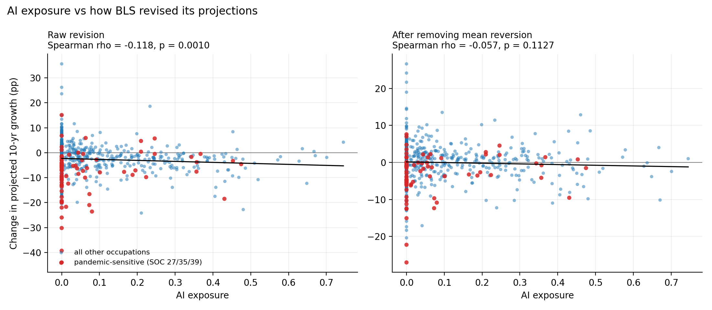
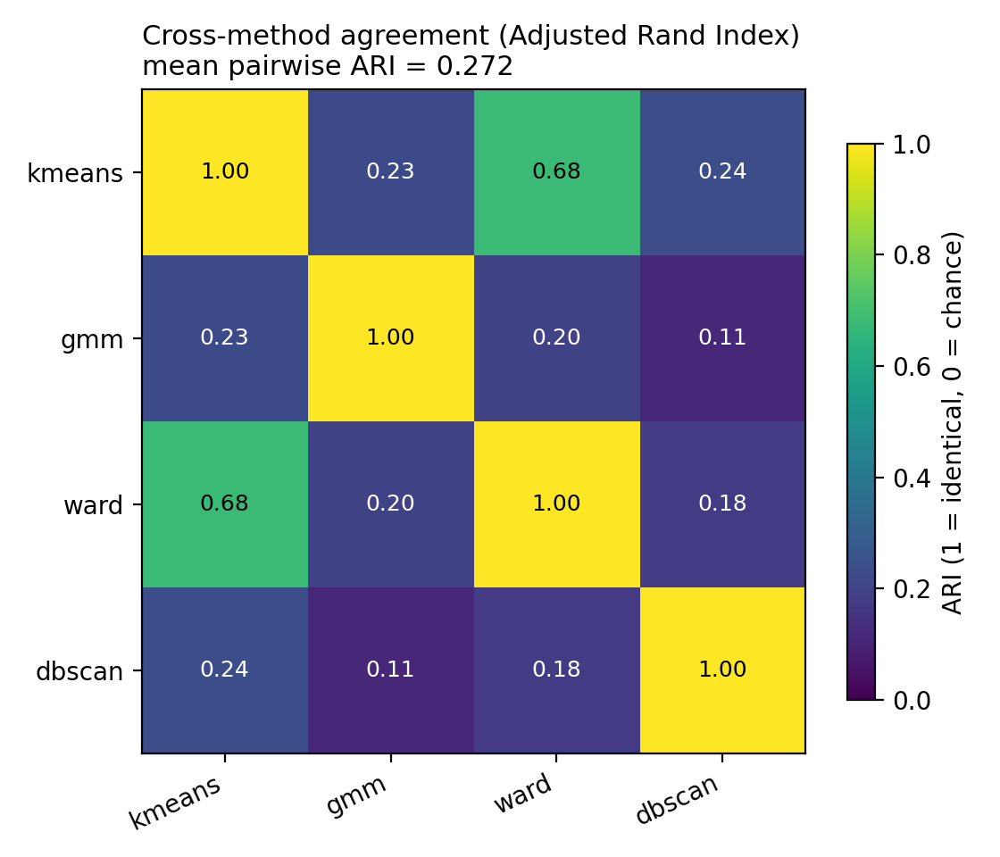

# AI exposure and changing occupational outlooks

How did the Bureau of Labor Statistics (BLS) change its ten-year employment projections after generative artificial intelligence (AI) became widely available, and were the largest revisions concentrated in occupations with greater AI exposure?

This project compares the BLS 2021–31 projections, finalized before ChatGPT's public release, with the 2024–34 projections released in 2025. It combines those vintages with four measures of AI exposure and task information from the Occupational Information Network (O\*NET). Four unsupervised clustering methods describe occupational structure; separate correlation tests evaluate the relationship between exposure and projection revisions.

**Main result:** AI exposure is negatively correlated with raw projection revisions, but most of that relationship weakens after accounting for pre-AI projected growth. Two direct large language model (LLM) exposure measures remain significant after false discovery rate correction. Cluster-level results are sensitive to the statistical test: the one-way analysis of variance (ANOVA) is not significant, while the rank-based Kruskal–Wallis test is significant. This is evidence for caution rather than a clean displacement effect.

For the full methodology, results, limitations, and citations, see [`appendix.md`](appendix.md).


## Reproduce the analysis

Python 3.9 or newer is recommended. From the repository root, run:

```bash
python3 -m pip install -r requirements.txt

python3 build_ai_jobs_dataset.py
python3 analyze_exposure_revision.py
python3 cluster_four_methods.py
python3 make_figures.py
python3 raw/first_visual.py
python3 raw/second_prelim_visual.py
python3 raw/third_visual.py
```

Run the commands in that order. The first four scripts build the analysis dataset, run the statistical tests, fit the clustering models, and generate the four analytical figures. The final three scripts generate the contextual BLS and AI-use figures. All scripts resolve paths relative to the repository, so they may be invoked from another working directory as well.

No API key, account, or configuration file is required. Almost all inputs are committed under `raw/`. The BLS 2010→2018 Standard Occupational Classification (SOC) crosswalk is the exception: when it is absent and cannot be downloaded, the build completes with a clearly reported fallback that assumes unchanged SOC codes. That fallback reduces accuracy for occupations whose codes changed.

To list missing inputs and their source URLs without downloading anything:

```bash
python3 build_ai_jobs_dataset.py --manual
```

### Useful options

```bash
python3 build_ai_jobs_dataset.py --pre 2019-29
python3 build_ai_jobs_dataset.py --skip-optional
python3 analyze_exposure_revision.py --drop-pandemic
python3 cluster_four_methods.py --kmax 6
python3 cluster_four_methods.py --include-outcome
```

`--include-outcome` intentionally adds the projection revision to the clustering features as a circular comparison. It is excluded by default.

## Current results

- The combined panel contains 832 occupations; 772 have complete values for the nine clustering features.
- Pre-AI projected growth explains about 40% of the variance in projection revisions, illustrating substantial regression to the mean.
- Twelve AI-exposure measures are tested. Two residualized direct-LLM measures pass Benjamini–Hochberg false discovery rate correction.
- K-means selects two clusters containing 316 and 456 occupations, with a silhouette score of 0.264.
- Mean pairwise Adjusted Rand Index (ARI) across k-means, Gaussian mixture modeling (GMM), Ward hierarchical clustering, and density-based spatial clustering of applications with noise (DBSCAN) is 0.271. The methods therefore impose different partitions on what looks largely like a continuum.
- DBSCAN leaves 180 occupations unassigned as noise.
- Projection revisions differ by k-means cluster under Kruskal–Wallis (`p = 0.0240`) but not under ANOVA (`p = 0.4967`).



The left panel shows the modest negative raw relationship. The right panel shows that it becomes much weaker after removing mean reversion.



The low off-diagonal ARI values show that the methods disagree about most fine-grained group assignments; the clusters should be interpreted as descriptive strata, not natural occupational types.

## Repository structure

```text
build_ai_jobs_dataset.py       Build the occupation and occupation-task datasets
analyze_exposure_revision.py   Run correlations, residualization, and multiple-test correction
cluster_four_methods.py        Fit k-means, GMM, Ward, DBSCAN, and principal component analysis
make_figures.py                Generate the four analytical figures
appendix.md                    Detailed report, limitations, and data citations
requirements.txt               Python dependencies
raw/                           Source datasets and three contextual plotting scripts
out/                           Generated analysis CSV files
figures/                       Generated charts
```

## AI assistance disclosure

Claude was used to assist with portions of programming and proofreading. All reported results should be evaluated against the executable scripts and generated outputs in this repository.
